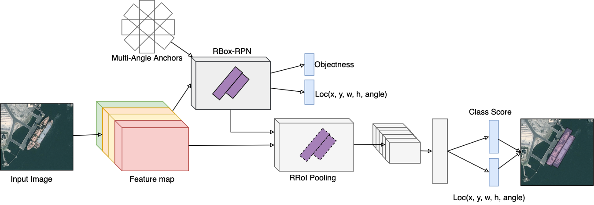

# RBox-CNN

This is implementation of simplified version of RBox-CNN ["RBox-CNN: rotated bounding box based CNN for ship detection in remote sensing image"](https://dl.acm.org/citation.cfm?id=3274915).  
This code is based on [Tensorflow Object Detection API](https://github.com/tensorflow/models/tree/master/research/object_detection) and specially modified for the [Object Detection Challenge in Satellite Image](https://dacon.io/agreement10)



## Requirements
- python 3.5+ 
- tensorflow 1.6
- opencv-python 3.4
- protobuf 3.0

## Installation
Protobuf Compliation(ref: [https://github.com/tensorflow/models/blob/master/research/object_detection/g3doc/installation.md](https://github.com/tensorflow/models/blob/master/research/object_detection/g3doc/installation.md))
```
protoc protos/*.proto --python_out=.
```

## Dataset Preparation
We only provide a code to create tfrecords from GeoJson.  
Data format:
```  
   ├── Root
       ├── labels.geojson    
       ├── images  
           ├── *.png    
```

TFRecords for training are created from GeoJson by create_dataset.py
```
python create_dataset.py --src_dir='Root directory to geojson and images'
                         --dst_path='Path to save tfrecords'
                         ...
```


## Training
#### Configuring the model pipeline
The config file of simplified RBox-CNN is "/configs/rbox_cnn_resnent101.config"  
You have to set input path of tfrecords in the config file.
More parameters for training refer to [Tensorflow Object Detection API](https://github.com/tensorflow/models/blob/master/research/object_detection/g3doc/configuring_jobs.md)

```
tf_record_input_reader {
  input_path: "/usr/home/username/data/train.record"
}
label_map_path: "/usr/home/username/data/label_map.pbtxt"
```

#### Running the training model 
```
python train.py --pipeline_config_path='Path to a config file of the model'
                --train_dir='Directory to save the checkpoints and training summaries'
                ...
                
```

## Evaluation
You can evaluate a trained model using tfrecords. The results of mAP and images are plotted by TensorBoard.   
You have to set input path of tfrecords in the config file.
More parameters for training refer to [Tensorflow Object Detection API](https://github.com/tensorflow/models/blob/master/research/object_detection/g3doc/configuring_jobs.md)

```
eval_config:
{
    num_examples: Number of samples 
    eval_input_reader {
        input_path: "/usr/home/username/data/train.record"
    }
    label_map_path: "/usr/home/username/data/label_map.pbtxt"
```

#### Running the evaluating model 
You can select a evaluation mode.
 - 'latest': it run infinite and the latest checkpoint is evaluated.
 - 'latest_once': latest checkpoint is evaluated and it finishes evaluation.
 - 'all', all checkpoints are evaluated and it finishes evaluation.
```
python train.py --pipeline_config_path='Path to a config file of the model'
                --checkpoint_dir='Directory to save the checkpoints and training summaries'
                --eval_dir='Directory to write eval summaries to'
                --run_mode='One of [latest, latest_once, all]'
                ...               
```

We provide a shell script('train_n_eval.sh') for train and evaluation.


## Extras
We provide a submission code for [Object Detection Challenge in Satellite Image](https://dacon.io/agreement10).
The submission code is "inference.py and run steps below.
1. Split images into small patch images
2. Infer patch images
3. Merge detected objects of patch images
4. Apply NMS to remove overlapping detected objects
5. Save CSV file for submission

```
python inference.py --pipeline_config_path='Path to a config file of the model'
                    --ckpt_path='Path to trained checkpoint, typically of the form path/to/model-%step.ckpt''
                    --image_dir='Directory to write eval summaries to'
                    --dst_path='Path to save detection output(CSV file)'
                    ...               
```
